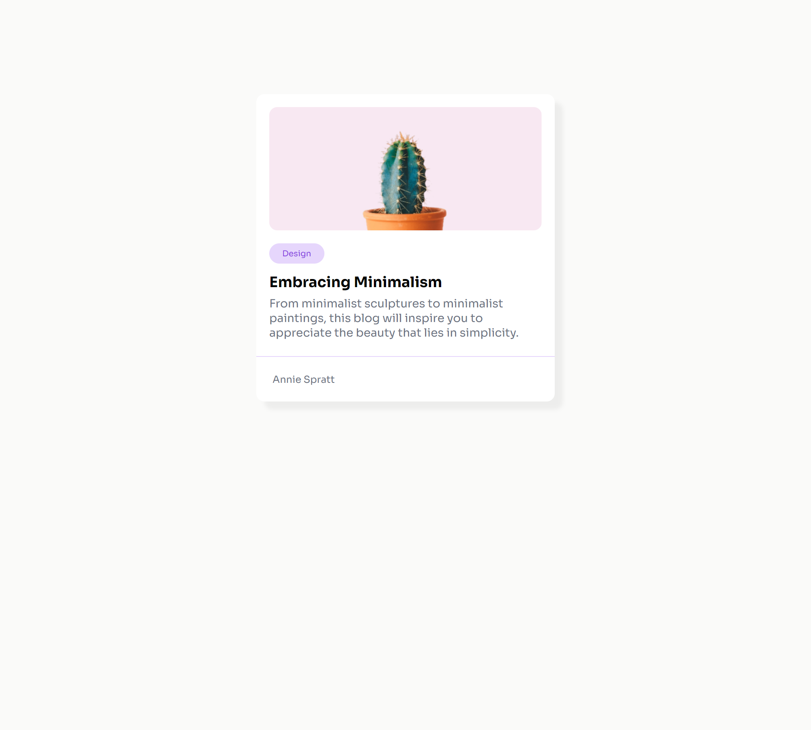

# Proyecto de Tarjeta de Blog Minimalista

Este es un proyecto de tarjeta de blog minimalista creado con **HTML** y **CSS**. La tarjeta está diseñada para ser sencilla y visualmente atractiva, enfocándose en el contenido y la estética minimalista. El diseño es completamente responsive, asegurando una correcta visualización en diferentes tamaños de pantalla.

## Características

- **Interfaz amigable**: Interfaz simple y fácil de usar para explorar el contenido del blog.
- **Responsive Design**: El diseño se adapta a diferentes tamaños de pantalla, desde dispositivos móviles hasta monitores de escritorio.
- **HTML semántico**: Estructura clara y accesible.
- **Uso de imágenes**: Presenta imágenes de alta calidad para acompañar el contenido.
- **Uso de variables CSS**: Colores personalizables para un diseño atractivo y cohesivo.

## Tecnologías Utilizadas

- **HTML**: Para la estructura de la página.
- **CSS**: Para el estilo y diseño visual del sitio.
- **Google Fonts**: Para las fuentes tipográficas.

## Vista Previa del Proyecto



## Cómo Ejecutarlo Localmente

1. Clona el repositorio:
    ```bash
    git clone https://github.com/ingjoseyepez/Tarjeta-de-Blog-Minimalista.git
    ```
2. Navega a la carpeta del proyecto:
    ```bash
    cd nombre-del-repositorio
    ```
3. Abre el archivo `index.html` en tu navegador.

## Estructura del Proyecto

```bash
/
├── index.html
├── style.css
└── README.md
